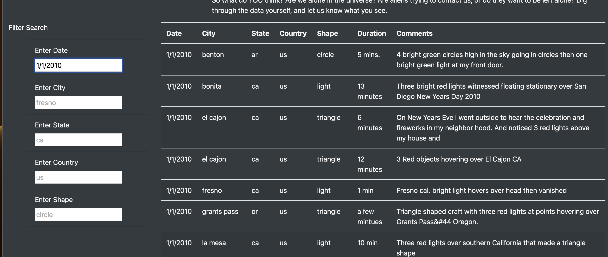

# UFOs

##Overview of the analysis:

I am helping Dana whom is a Data Journalist create a Java Script file which is filled with informtaion from different Counitries, Cities, States about UFOs. The purpose of the project is due to the large amount of data we have, we want to make it more accurate, clear, user friendly with the help of Java. I will use Java to create a html page where its easy to access the data using various filters.

Results:

The html page I have created is very easy to use at the moment. We can access data about UFOs by filtering the information by State, City, Date, Country, and Shape.

Below is an image example by State:

Below is an image example by Date:

Below is an image example by State and Date: 

Summary:

The main drawback I see is that the search engine we have created can be more advanced.  
To solve the issue I see with the drawback; my first recomendation is to have a button included for “GO” or “SEARCH” because as of now when we open the webpage it looks kind of empty. Another recomendation I have it to add more filters example like a “Date Range” and to add more than one city, if a user wanted to see results for two cities, there should be a filter for it. 
